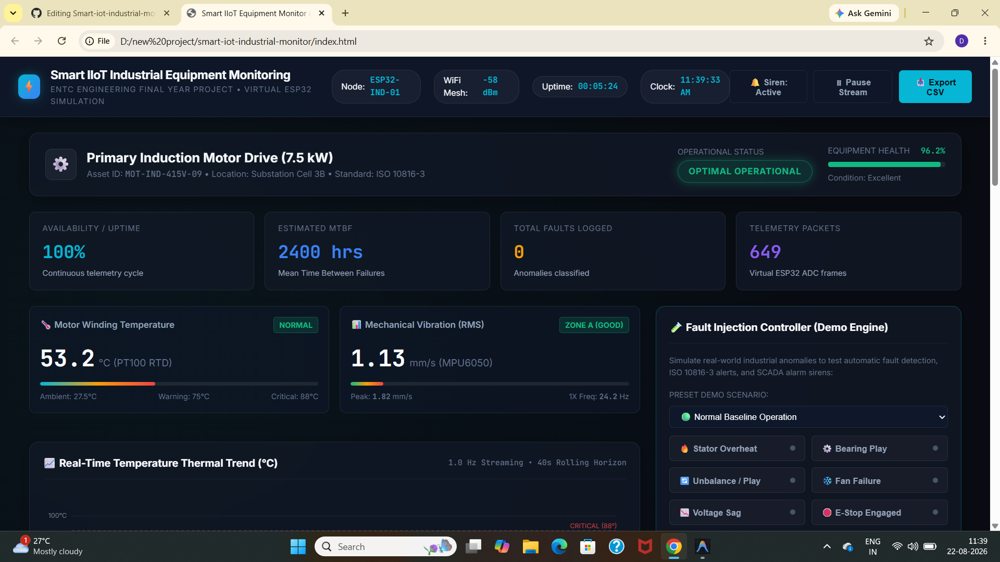

# Smart IoT-Based Industrial Equipment Monitoring and Fault Detection System

An advanced **Software-Based Industrial IoT (IIoT) Simulation & SCADA Monitoring System** designed for **Electronics and Telecommunication Engineering (ENTC/ECE)** final-year projects.

---

## 🚀 Quick Start (Zero Setup Required)

This project requires **NO external software installation**, **NO terminal commands**, and **NO internet connection**.

1. Navigate to the project directory:
   ```
   d:\new project\smart-iot-industrial-monitor
   ```
2. Double-click **`index.html`** or right-click and select **"Open with Google Chrome"** (or Microsoft Edge / Firefox).
3. The dashboard will launch immediately with live real-time telemetry, animated charts, and simulated sensor streams!

---


## 🌟 Key Features

- ⚡ **Virtual ESP32 Microcontroller Node:** Dual-core FreeRTOS simulation generating 2 Hz telemetry with realistic mathematical physics models.
- 🌡️ **PT100 Temperature Sensor Simulation:** First-order thermal inertia model with ambient dissipation and thermal runaway detection.
- 🌊 **MPU6050 Vibration & Oscilloscope:** Real-time RMS velocity classification according to **ISO 10816-3 (Zones A, B, C, D)** and time-domain waveform analysis.
- ⚡ **Electrical Parameters Monitoring:** 3-Phase Voltage (415V), Line Current (Amps), Active Power (kW), Shaft RPM, and Power Factor ($\cos\phi$).
- 🧪 **Interactive Fault Injection Suite (Demo Controller):**
  - Stator Overheating
  - Bearing Micro-Crack Defect
  - Rotor Mechanical Unbalance
  - Cooling Fan Blockage
  - Grid Voltage Sag
  - Emergency Stop Interlock (E-STOP)
- 🚨 **Audio-Visual SCADA Alarm Matrix:** Real-time notifications with actionable maintenance prescriptions and Web Audio API synthesized industrial siren.
- 📊 **Key Performance Indicators (KPIs):** Machine Health Index (0-100%), Uptime Availability %, Estimated MTBF (Mean Time Between Failures), and Telemetry Frames.
- 📑 **Historical Audit Log & CSV Exporter:** Live filterable table with one-click **"Export CSV"** for engineering reports.

---

## 📁 Project Structure

```
smart-iot-industrial-monitor/
├── index.html                  # Main Industrial SCADA Dashboard
├── css/
│   ├── style.css               # Dark cyber-industrial design system
│   └── components.css          # Gauges, badges, buttons, alarm cards
├── js/
│   ├── virtual_esp32.js        # ESP32 FreeRTOS & physics simulation engine
│   ├── anomaly_engine.js       # ISO 10816-3 fault classification & health score
│   ├── charts.js               # 60 FPS Canvas real-time graphs & oscilloscope
│   ├── fault_injector.js       # Interactive failure mode injector
│   ├── sound_alerts.js         # Web Audio API synthetic alarm buzzer
│   ├── database.js             # Historical time-series storage & CSV export
│   └── dashboard.js            # Main UI controller & telemetry subscriber
├── docs/
│   ├── ARCHITECTURE.md         # 4-Layer IoT architecture & block diagrams
│   ├── SENSOR_MATH.md          # Mathematical formulas & physics equations
│   └── VIVA_QUESTIONS.md       # 25+ ENTC viva questions & prepared answers
└── README.md                   # Project overview & manual
```

---

## 🎓 Academic Documentation
- **[System Architecture (ARCHITECTURE.md)](docs/ARCHITECTURE.md)**
- **[Physics & Sensor Mathematics (SENSOR_MATH.md)](docs/SENSOR_MATH.md)**
- **[Examiner Viva Preparation Guide (VIVA_QUESTIONS.md)](docs/VIVA_QUESTIONS.md)**
